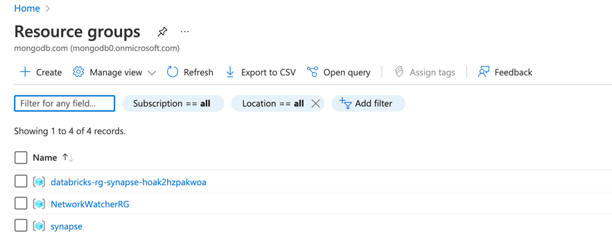

## Azure synapse

### Content:
1. What is synapse?
2. Data integration for batch and real time processing using MongoDB Atlas and Synapse.
3. Setup MongoDB Atlas cluster.
4. Create a Synapse workspace.
5. Batch:
   1. Create Synapse pipeline to load data from Atlas to Blob storage.
   2. Read Table data in Avro format.
   3. Integrate/enrich the data using Apache spark (Databricks).
   4. Sink - MongoDB atlas, Synapse SQL datawarehouse 

## What is synapse?
Azure Synapse is an enterprise analytics service that accelerates time to insight across data warehouses and big data systems. Azure Synapse brings together the best of SQL technologies used in enterprise data warehousing, Spark technologies used for big data, Data Explorer for log and time series analytics, Pipelines for data integration and ETL/ELT, and deep integration with other Azure services such as Power BI, CosmosDB, and AzureML.

## Data integration for batch and real time processing using MongoDB Atlas and Synapse.

## Setup MongoDB Atlas cluster:
* Log-on to your Atlas account and Navigate to your project.

* Create a cluster if you don't have one. This demo will also work with a free tier cluster. (To use a dedicated cluster, Use GETATLAS promo code to get the free credits).

* Create a new user by navigating to Database Access -> Add user and add the admin role to the user.

* Create Ip address whitelist for your cluster by navigating to Network access (For the demo purpose you can whitelist 0.0.0.0/0 - Not recommended on production clusters).

* Create a database named mdb-retails.

* Navigate to your cluster and click on connect. Choose the Standard connection. Click on Connect to you Application and make note of your connection string i.e. required for running further steps in this demo.

## 2. Create a Synapse workspace.
Log-on to your azure portal.
Create a resource group by navigating to resource with name of your preference.
- 

Create a Synapse Workspace to create your pipelines That will read the data from Atlas using Atlas source connector and store the data to Azure blob storage/ SQL.
- 

To create resources in your resource group, Click on Create button as shown below.
- 

Search for Azure synapse analytics and click on Azure synapse analytics as shown below.
- 

Create Azure Synapse Analytics workspace. Fill out the required fields and click on *Review+Create*
- 
- 

Create a storage account. It will be used for storing the data as a sink on azure. 
- 

Post creation of Synapse workspace. Click on the *Open Synapse Studio*
- 

Click on Integrate from side pane and click on + to create a new pipeline.
- 

### Batch and micro-batch :
To load batch and microbatch data from Mongodb Atlas to your Azure synapse analyics, Click on *Move & transform* in *Activities* and drag and drop the Copy data.
- 

Add name, description, retry interval as per the requirement in the General tab of the pipeline component.  
- 
Select the Source tab and click on *New* select new Integration dataset as shown below. Click on continue.
- 
Provide the name and under linked service click on +New.
- 
Provide a name to your Mongodb Atlas linked service and From Atlas paste the connection string. Also provide the database name from where you want to import the data from. Click on *Create*.
- 

Once the new source is ready, Provide the name of your collection you want to collect the data from. Back on your Pipeline stage, Select MongoDB Source dataset you have just created.

Now provide the Sink to your dataset. For our case we will be storing the data into Azure Gen2 Datalake. 
- 

Create a Gen2 datalake and in your sink dataset provide the Azure datalake as input. Store the transformed data into Parquet format. Make sure to do the Schema mapping before you proceed with next steps. 

To Simulate the other data source we have used a Pipeline to store the Orders data from Atlas to Azure in CSV format. Which inturn we are reading and storing in Parquet format. 

- 

Create a Dataflow pipeline from activities. Add stages to Copy the data from MongoDB and other source and merge it using left outer join as shown below. 
- 
- 

Repeate the steps for the other data source as well.

Once the dataflow job is ready. Click on the Debug button to run the pipeline. The data from our both data sources will be read and copied into the Azure synapse (i.e. on the Gen2 datalake).

To Run the analytics on the data Read you can Create sparks job by navigating to the Develop, And click on +, Create Notebook. Note: you will require a spark node pool to run the script. 

